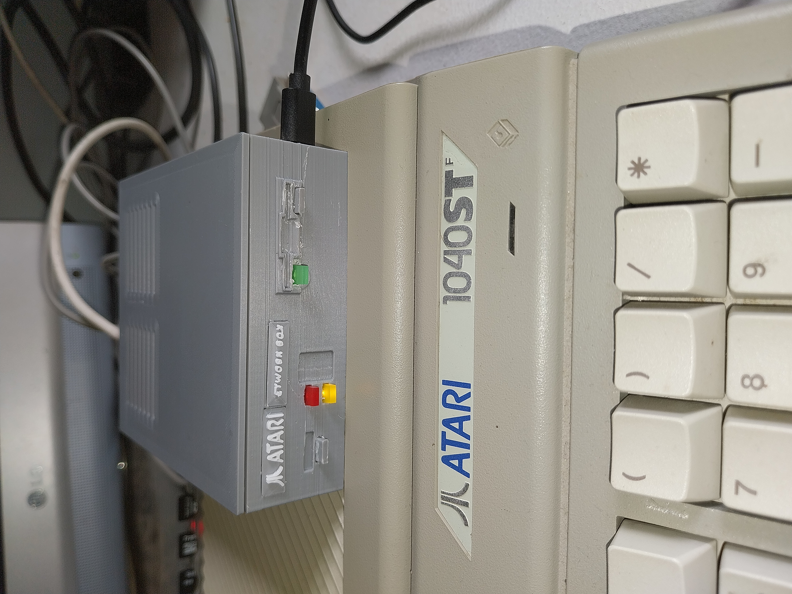

# The Atari NetworkBox

> Français d'abord — English version below.

Une passerelle réseau autonome pour Atari ST : le port modem RS-232 est
converti par un MAX3232 vers un Raspberry Pi Pico 2 W. L'Atari utilise STinG
en SLIP à **19 200 bauds, 8N1** et peut accéder au réseau par Wi-Fi ou RJ45.

## Fonctions validées

- navigation HTTP avec HighWire ;
- FTP avec Litchi ;
- DNS, ping et TCP/IP via STinG / SLIP ;
- firmware Wi-Fi seul, RJ45/W5500 seul, ou Wi-Fi + RJ45 unifié ;
- bouton de sélection et LEDs facultatives pour le firmware unifié.

Le débit est volontairement limité par le port série d'un Atari STF d'origine
(19 200 bauds). C'est normal : ce projet privilégie une liaison stable et
autonome.

## Démarrage rapide

1. Imprimez le boîtier de `case_stl/` si souhaité.
2. Réalisez le câblage décrit dans [WIRING.md](WIRING.md).
3. Flashez **un seul** fichier `.uf2` depuis `firmware/` :
   - `...WIFI_only_v1.0.5.uf2` : Wi-Fi uniquement ;
   - `...W5500_RJ45_only_v1.0.4.uf2` : RJ45 uniquement ;
   - `...WIFI_and_RJ45_v0.6.5.uf2` : version unifiée recommandée.
4. Installez STinG sur l'Atari puis utilisez les exemples de
   `atari_config_examples/`. Consultez `docs/STING_SETUP.md`.
5. Pour le Wi-Fi, utilisez le portail de configuration décrit dans
   `docs/WIFI_SETUP.md`.

Les fichiers `.uf2` s'installent en maintenant **BOOTSEL** enfoncé pendant le
branchement USB du Pico, puis en déposant le fichier sur le disque USB du Pico.

## Organisation

- `firmware/` : firmwares compilés prêts à flasher ;
- `source/` : code source des trois variantes ;
- `case_stl/` : boîtier imprimable ;
- `atari_config_examples/` : exemples STinG et Litchi ;
- `images/` : prototype, schéma et captures Atari ;
- `docs/` : installation et ressources.

## État du prototype

Projet matériel open source réalisé comme prototype. Les modules, le boîtier
et les connecteurs peuvent varier : vérifiez toujours les sérigraphies de votre
MAX3232 et W5500 avant alimentation. Voir [WIRING.md](WIRING.md).

## Licence

Le code source et les firmwares sont sous [licence MIT](LICENSE). Le boîtier,
le câblage, les images et la documentation sont sous [CC BY
4.0](LICENSES/CC-BY-4.0.md). La réutilisation et la vente sont autorisées, à
condition de conserver le crédit de Denis Costils et les notices de licence.
Les composants tiers conservent leurs propres licences : voir
[THIRD_PARTY_NOTICES.md](THIRD_PARTY_NOTICES.md).

---

# English

The Atari NetworkBox is a standalone network gateway for the Atari ST. A
MAX3232 converts the RS-232 modem port to a Raspberry Pi Pico 2 W UART. The
Atari runs STinG over SLIP at **19,200 baud, 8N1**, with Wi-Fi or Ethernet
connectivity.

Validated features: HTTP with HighWire, FTP with Litchi, DNS, ping and TCP/IP.
Three ready-to-flash firmwares are supplied: Wi-Fi only, W5500 Ethernet only,
and a combined Wi-Fi + Ethernet version.

See [WIRING.md](WIRING.md) for hardware, `docs/STING_SETUP.md` for Atari
configuration and `docs/WIFI_SETUP.md` for Wi-Fi setup.

## License

Source code and firmware are [MIT licensed](LICENSE). Case files, wiring,
images and documentation are licensed under [CC BY 4.0](LICENSES/CC-BY-4.0.md).
Commercial reuse is allowed with credit and preservation of license notices.
