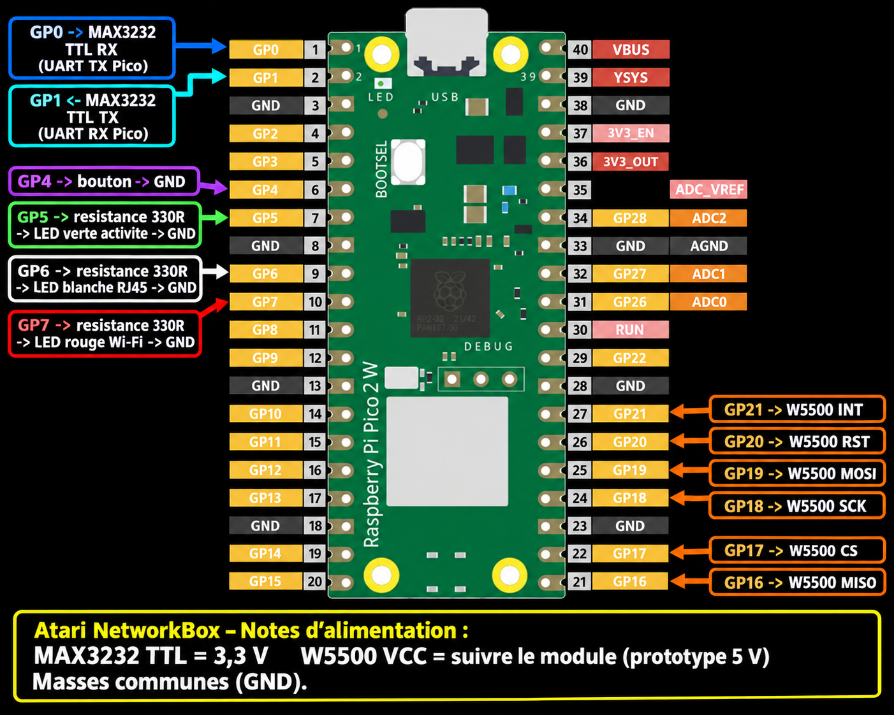
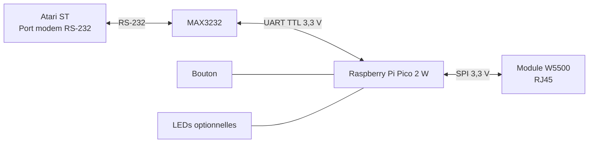

# Atari NetworkBox — schéma de câblage

**Français : première partie de ce document. English: full translation in the
second part of this document.**

Ce schéma correspond au firmware **Wi-Fi + RJ45 unifié** pour Raspberry Pi
Pico 2 W. Toutes les masses (`GND`) doivent être communes.

> Important : le Pico est en logique **3,3 V**. La partie TTL du MAX3232 doit
> être en 3,3 V. Les signaux GPIO du Pico ne doivent jamais recevoir 5 V.

## 1. Atari ST vers MAX3232

Sur le port modem DB25 de l'Atari :

| Atari ST | Rôle | MAX3232 côté RS-232 |
|---|---|---|
| DB25 broche 2 | TXD, sortie Atari | RXD, entrée du MAX3232 |
| DB25 broche 3 | RXD, entrée Atari | TXD, sortie du MAX3232 |
| DB25 broche 7 | masse signal | GND |

Si le boîtier utilise une DB9 et un adaptateur/null-modem DB9 ↔ DB25, le
principe ne change pas : **TX de l'Atari arrive sur RX du MAX3232, et inversement**.

## 2. MAX3232 vers Pico 2 W

| Pico 2 W | Signal | MAX3232 côté TTL |
|---|---|---|
| GP0 | UART0 TX, sortie Pico | RXD / entrée TTL du module |
| GP1 | UART0 RX, entrée Pico | TXD / sortie TTL du module |
| 3V3(OUT) | alimentation logique | VCC |
| GND | masse | GND |

Les sérigraphies `TXD` et `RXD` varient selon les petits modules MAX3232.
La règle à suivre est toujours : **TX Pico → RX module** et **TX module → RX Pico**.

Réglage série Atari : **19 200 bauds, 8N1, SLIP**.

## 3. Pico 2 W vers W5500

| Pico 2 W | W5500 | Fonction |
|---|---|---|
| GP16 | MISO | données W5500 → Pico |
| GP17 | CS / SCS | sélection du W5500 |
| GP18 | SCK / SCLK | horloge SPI |
| GP19 | MOSI | données Pico → W5500 |
| GP20 | RST / RESET | réinitialisation W5500 |
| GP21 | INT | interruption W5500 |
| 5V (VBUS) ou 3V3(OUT), selon le module | VCC | alimentation du module |
| GND | GND | masse |

Le **W5500 nu fonctionne en 3,3 V**, mais beaucoup de modules W5500 vendus
pour Arduino/Raspberry possèdent un régulateur et acceptent aussi le **5 V**
sur leur broche `VCC`. C'est le cas du module utilisé pour ce prototype : il
est alimenté en **5 V**. Il faut donc suivre la sérigraphie ou la fiche du
module exact. Quel que soit son VCC, les lignes SPI venant du Pico restent en
logique **3,3 V**.

## 4. Bouton et LEDs — firmware unifié

Le bouton et les LEDs sont facultatifs pour le firmware Wi-Fi seul. Ils sont
utilisés par le firmware unifié.

### Bouton

| Pico 2 W | Câblage |
|---|---|
| GP4 | une patte du bouton |
| GND | autre patte du bouton |

Le firmware utilise une résistance interne : **aucune résistance externe n'est
nécessaire**. Au démarrage, maintenir le bouton force le Wi-Fi. Une fois en
Wi-Fi, maintenir trois secondes ouvre la page de configuration.

### LEDs

Chaque LED utilise une résistance en série de **330 Ω à 1 kΩ**. Une résistance
de 330 Ω fonctionne, mais 680 Ω ou 1 kΩ donne une lumière moins agressive.

| Pico 2 W | Couleur proposée | Fonction |
|---|---|---|
| GP5 → résistance → anode LED, cathode → GND | verte | activité réseau |
| GP6 → résistance → anode LED, cathode → GND | blanche | RJ45 sélectionné |
| GP7 → résistance → anode LED, cathode → GND | rouge | Wi-Fi sélectionné ; clignote pendant la configuration |

## Vérification avant mise sous tension

1. Vérifier une masse commune Pico, MAX3232 et W5500.
2. Alimenter le MAX3232 en 3,3 V ; pour le W5500, suivre la tension indiquée
   par le module (5 V pour le module du prototype).
3. Vérifier le croisement TX/RX entre Pico et MAX3232.
4. Ne pas relier directement une sortie RS-232 de l'Atari au Pico : le
   MAX3232 est obligatoire pour convertir les niveaux électriques.

## Limitation connue du prototype RJ45

Si le réseau RJ45 devient totalement inactif et que la LED d'activité reste
fixe, débrancher puis rebrancher l'alimentation de la NetworkBox afin de
réinitialiser le Pico et le W5500. La récupération automatique du W5500 est
prévue pour une évolution ultérieure.

---

# English version

This wiring guide is for the **Wi-Fi + RJ45 unified firmware** running on a
Raspberry Pi Pico 2 W. All grounds (`GND`) must be connected together.

> Important: the Pico GPIO logic level is **3.3 V**. The MAX3232 TTL side must
> use 3.3 V. Never connect 5 V directly to a Pico GPIO pin.

## 1. Atari ST to MAX3232

| Atari ST DB25 modem port | Role | MAX3232 RS-232 side |
|---|---|---|
| Pin 2 | TXD, Atari output | RXD, MAX3232 input |
| Pin 3 | RXD, Atari input | TXD, MAX3232 output |
| Pin 7 | signal ground | GND |

With a DB9 ↔ DB25 adapter/null-modem cable, the rule is unchanged: **Atari TX
goes to MAX3232 RX, and vice versa**.

## 2. MAX3232 to Pico 2 W

| Pico 2 W | Signal | MAX3232 TTL side |
|---|---|---|
| GP0 | UART0 TX, Pico output | RXD / TTL input of the module |
| GP1 | UART0 RX, Pico input | TXD / TTL output of the module |
| 3V3(OUT) | logic supply | VCC |
| GND | ground | GND |

The `TXD` and `RXD` labels differ between MAX3232 modules. Always follow the
signal direction: **Pico TX → module RX** and **module TX → Pico RX**.

Atari serial settings: **19,200 baud, 8N1, SLIP**.

## 3. Pico 2 W to W5500

| Pico 2 W | W5500 | Function |
|---|---|---|
| GP16 | MISO | W5500 → Pico data |
| GP17 | CS / SCS | W5500 chip select |
| GP18 | SCK / SCLK | SPI clock |
| GP19 | MOSI | Pico → W5500 data |
| GP20 | RST / RESET | W5500 reset |
| GP21 | INT | W5500 interrupt |
| 5V (VBUS) or 3V3(OUT), depending on module | VCC | module supply |
| GND | GND | ground |

The bare W5500 chip runs at 3.3 V. Many W5500 modules include a regulator and
accept 5 V on `VCC`. The prototype module is powered with **5 V**. Follow the
markings or datasheet of the exact module; Pico SPI signals always remain at
**3.3 V**.

## 4. Button and LEDs — unified firmware

The button and LEDs are optional with the Wi-Fi-only firmware, but used by the
unified firmware.

### Button

| Pico 2 W | Wiring |
|---|---|
| GP4 | one button leg |
| GND | other button leg |

An internal pull-up is used: **no external resistor is required**. Holding the
button at boot forces Wi-Fi. Once in Wi-Fi mode, hold it for three seconds to
open the configuration page.

### LEDs

Use one **330 Ω to 1 kΩ** series resistor per LED. 330 Ω works but 680 Ω or
1 kΩ gives a softer light.

| Pico 2 W | Suggested colour | Function |
|---|---|---|
| GP5 → resistor → LED anode, cathode → GND | green | network activity |
| GP6 → resistor → LED anode, cathode → GND | white | RJ45 selected |
| GP7 → resistor → LED anode, cathode → GND | red | Wi-Fi selected; blinks during setup |

## Check before powering on

1. Check the common ground between Pico, MAX3232 and W5500.
2. Supply the MAX3232 at 3.3 V. For the W5500, use the voltage stated by the
   module (5 V for the prototype module).
3. Check that TX/RX are crossed between Pico and MAX3232.
4. Never connect Atari RS-232 directly to the Pico: the MAX3232 level shifter
   is mandatory.

## Known RJ45 prototype limitation

If the RJ45 connection becomes completely inactive and the activity LED stays
on continuously, unplug and reconnect NetworkBox power to reset the Pico and
W5500. Automatic W5500 recovery is planned for a later revision.
