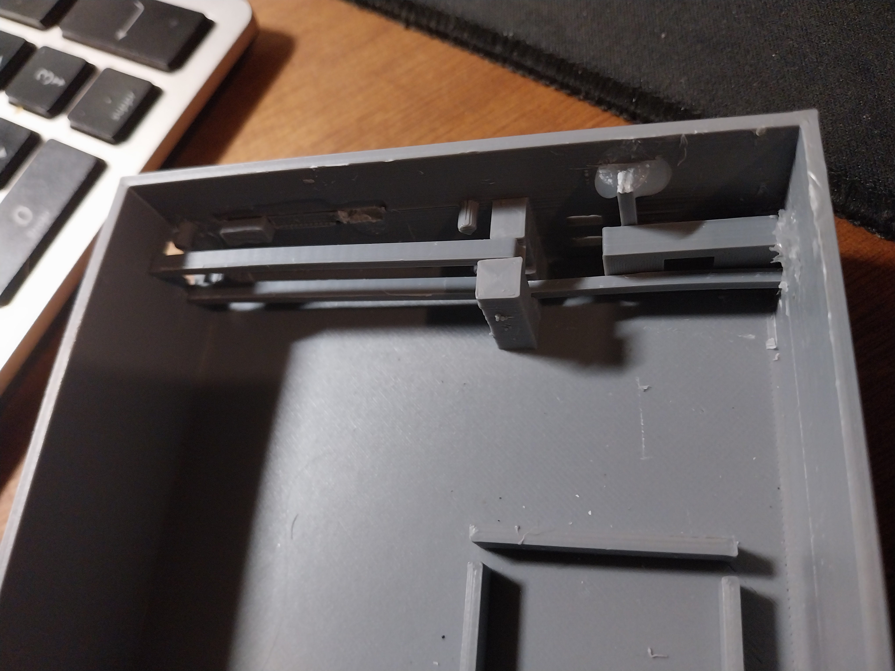
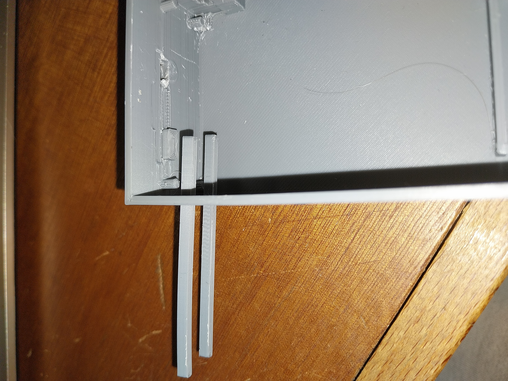
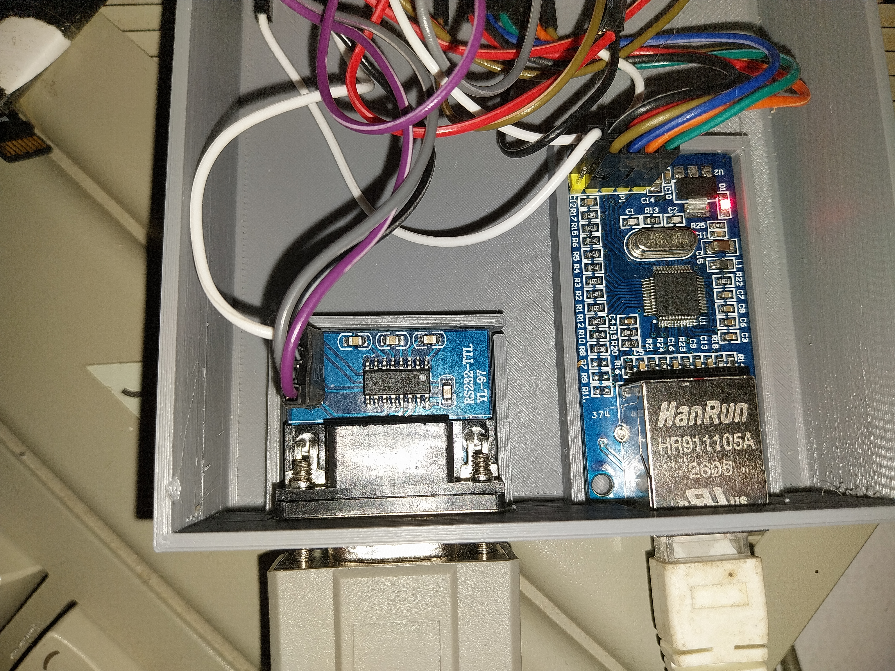
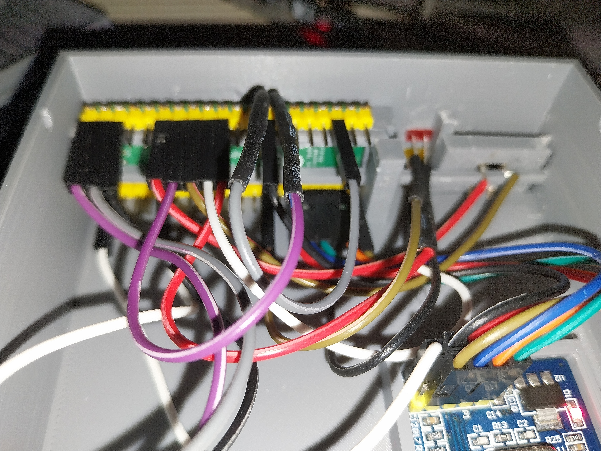
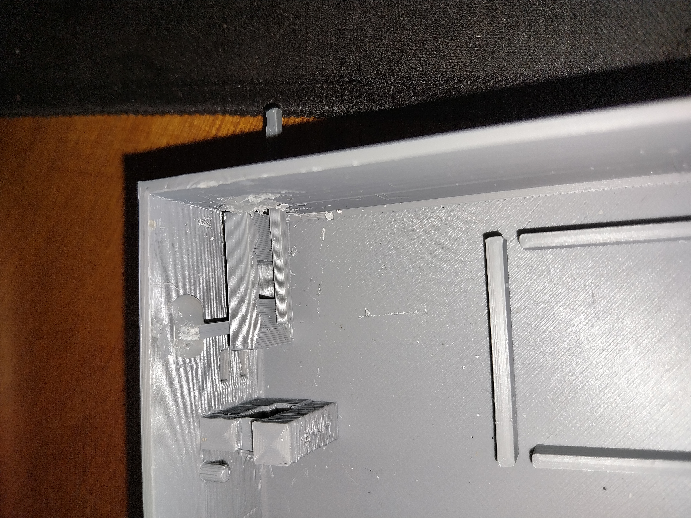

# Montage du boîtier / Case assembly

## Français

Ces photos montrent **le prototype réellement monté**. Commencez par repérer
les logements imprimés avant de brancher les fils. Pour les connexions
électriques, utilisez les **numéros de broches dans
[WIRING.md](../WIRING.md)** : la couleur des fils Dupont n'indique pas leur
fonction.

### 1. Repérer les guides du Pico

Les deux longues glissières parallèles maintiennent les bords de la carte
Raspberry Pi Pico 2 W. La photo ci-dessous montre leur emplacement dans le
boîtier vide.

Cette vue rapprochée montre l'extrémité par laquelle la carte se glisse.

Présentez le Pico entre les deux rails et faites-le coulisser doucement.
Orientez son connecteur USB vers la découpe prévue dans le boîtier pour qu'il
reste accessible une fois l'ensemble fermé. Vérifiez la position et l'accès
USB **avant** d'enfoncer les connecteurs Dupont ; ne forcez pas si une carte
ou un fil touche une paroi.

### 2. Placer les autres modules

Sur ce prototype, le module MAX3232 avec son connecteur DB9 est à gauche et
le module W5500 avec sa prise RJ45 est à droite, vus depuis l'intérieur et
avec les prises orientées vers l'extérieur.

La vue ci-dessous montre le Pico en place et le passage réel des fils. Elle
aide à visualiser l'encombrement, mais **ne remplace pas le schéma de
câblage** : les étiquettes des broches sont cachées par les fils sur la photo.

### 3. Vérifier le bouton avant de fermer

Le détail ci-dessous montre la pièce imprimée du bouton sur ce prototype.
Actionnez-la une fois à la main et vérifiez qu'elle revient librement avant
de poser le couvercle.

Après montage, contrôlez une dernière fois l'alimentation du MAX3232 en
3,3 V et celle de **votre modèle précis** de W5500. Le module W5500 de ce
prototype accepte le 5 V sur VCC ; d'autres modules peuvent différer. Les
signaux GPIO/SPI du Pico restent en 3,3 V.

---

## English

These photos show the actual prototype. The two long parallel rails hold the
edges of the Raspberry Pi Pico 2 W. Slide the board in gently, with its USB
connector facing the case opening so it remains accessible. Check clearance
before attaching the Dupont wires.

In the assembled prototype, the MAX3232/DB9 module is on the left and the
W5500/RJ45 module on the right when viewed from inside with the sockets facing
outward. The close-up of the fitted Pico shows available space and cable
routing. It does **not** identify GPIO connections: use the pin numbers in
[WIRING.md](../WIRING.md), not wire colours.

Check that the button moves freely before fitting the lid. Verify the power
requirements of your exact W5500 board; this prototype's module accepts 5 V
on VCC, while Pico GPIO and SPI signals are always 3.3 V.
